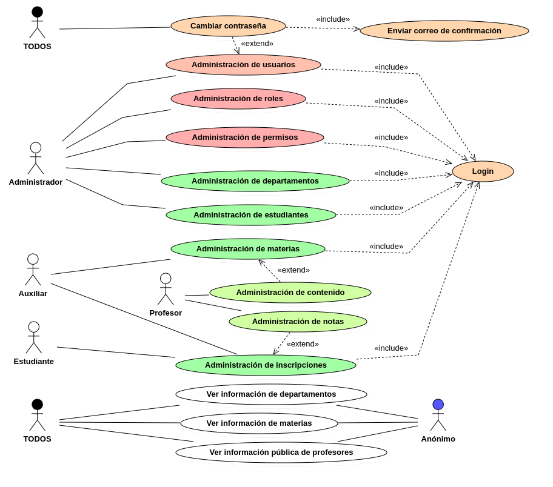
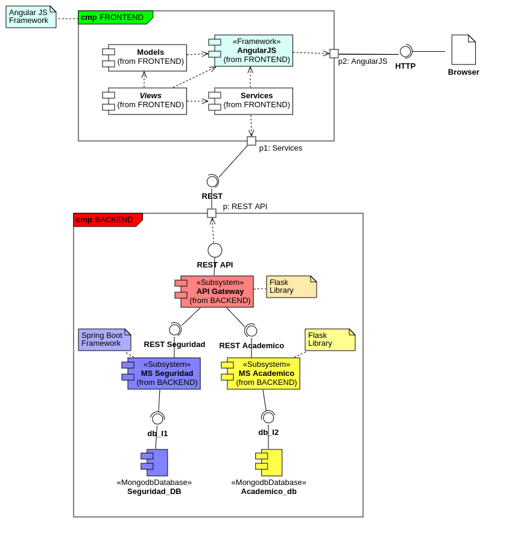
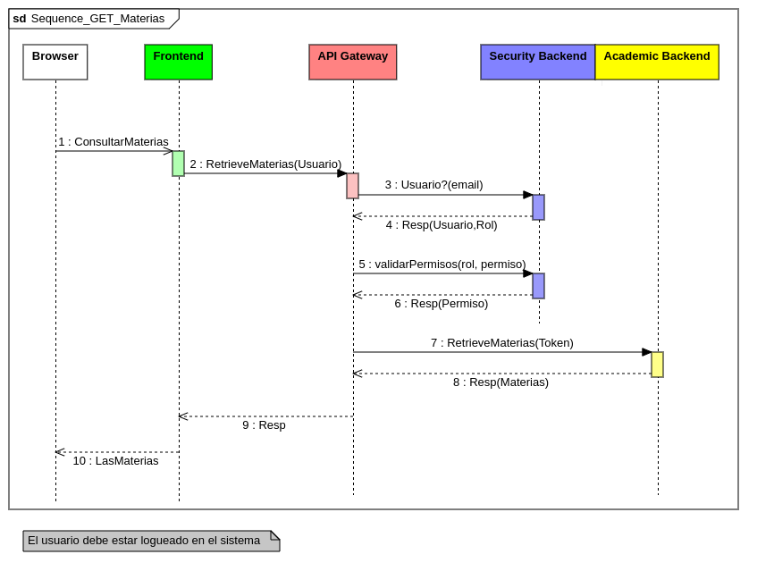

# apigateway_be_MisionTIC2022
Microservico ApiGateway (Backend) para el proyecto de ejemplo GESTIÓN ACADÉMICA.
> Usado en los programas Misión TIC 2022 y Programación Avanzada-Uniremington 2024

## Casos de uso

## Arquitectura

## Secuencia
La siguiente es la secuencia principal (asumiendo un usuario logueado y con permisos) para obtener el listado de materias
